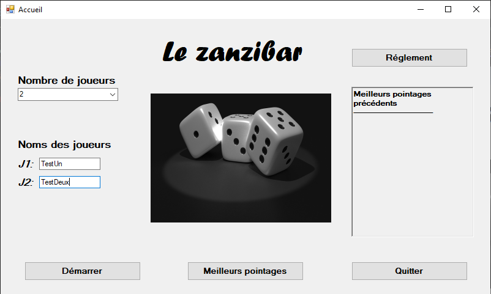
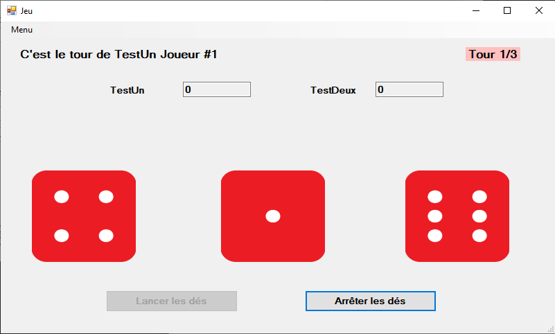

<div align='center'>
    <h1><b>🎲 [Le Zanzibar] 🎲</b></h1>
    <p>Zanzibar est un jeu de dés multijoueur développé en C# où 2 à 4 joueurs s'affrontent pour obtenir le score le plus haut possible en fonction des résultats aléatoires des dés. Chaque lancer peut changer le cours de la partie, 
      rendant le jeu imprévisible et amusant.</p>
</div>

---

## 🎯 **OBJECTIF DU JEU**
L'objectif du jeu est d'obtenir le score le plus haut possible en lançant les dés et en appliquant les règles du jeu. Chaque joueur joue à tour de rôle, et le joueur avec le score le plus haut à la fin de la partie est déclaré vainqueur.

<br />

---

## 📜 **DÉROULEMENT**
- Chaque joueur commence avec un score de 0.
- À chaque tour, un joueur lance trois dés.
- Les résultats des dés sont analysés selon les règles spécifiques du jeu :
  - Valeur 1 : Vaut 100 points.
  - Valeur 6 : Vaut 60 points.
  - Toutes les autres valeurs se valent en points.
 
**Gestion des erreurs**
- Le jeu inclut des vérifications pour empêcher les entrées invalides.
- Un système de messages d'erreur est mis en place pour guider les joueurs en cas d'actions invalides ou de bugs inattendus.
  
**Fin de partie**
- Le jeu se termine lorsque chacun des joueurs a lancé ses dés à trois reprises.

<br />

---

## 💾 **FONCTIONNALITÉS**

- Support de 2 à 4 joueurs.
- Gestion des scores et des tours.
- Option de changement de nom encore de partie.
- Sauvegarde des pointages et affichages des meilleurs pointages des parties précédentes.
- Interface utilisateur simple et intuitive.
- Gestion des erreurs et messages clairs pour guider les joueurs.

<br />

---

## 🗒️ **INSTALLATION**

1. cloner le dépot

```
git clone https://github.com/username/depot
```
2. ouvrir le projet dans Visual Studio ou tout autre IDE compatible avec C#

3. compiler et exécuter le projet pour commencer à jouer.


<br />

---

## 🔎 **APERÇU**





